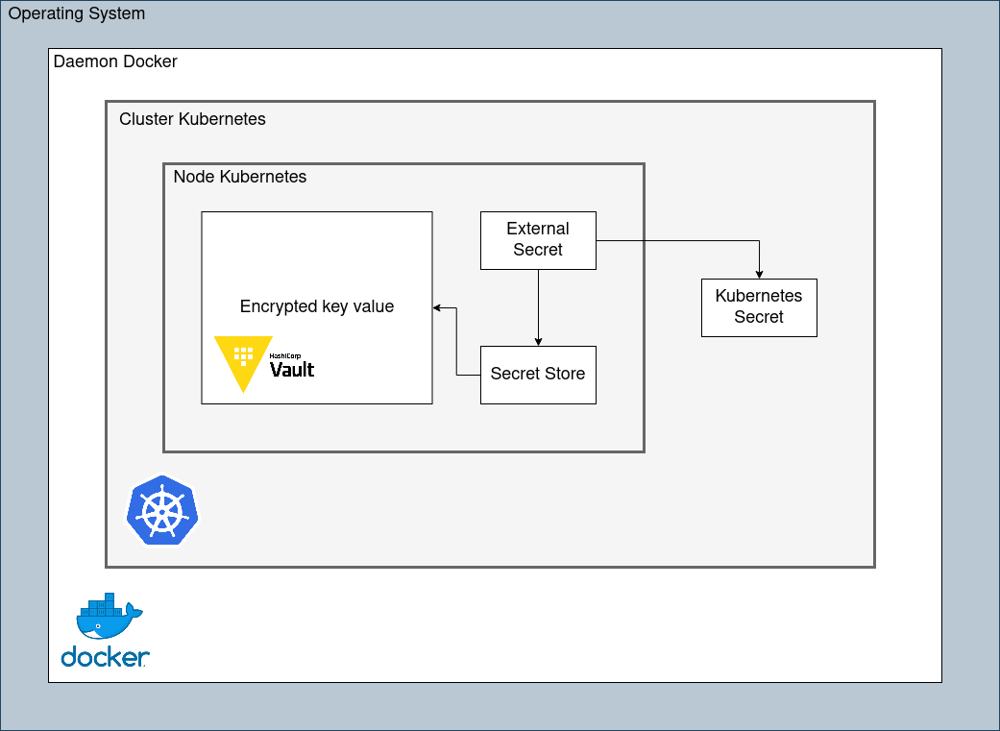

# Secret from Vault

This repository shows you how to create secret in your cluster from Hashicorp Vault

:warning: Never transform encrypted variable from Vault in base64 encoded data for sensitive values. You may prefer inject your sensitive values directly in pod where they are needed.


## Prerequisites


## How it works



## How to

1. Create your cluster - install Vault helm chart

    ```bash
    make start
    ```

2. Inject environments variables in as encrypted key value in Vault

    ```bash
    make 
    ```

3. Create secret in your cluster from encrypted key value 

    ```bash
    make 
    ```

## Cleanup your system

1. delete everything in your system about this project
    ```bash
    make delete
    ```
